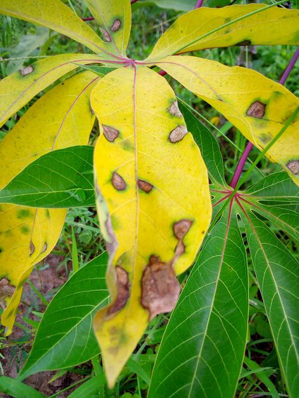
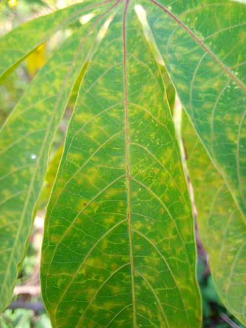
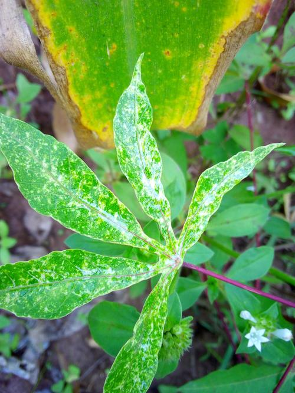
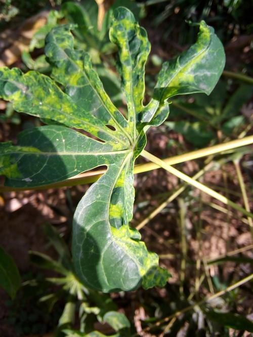
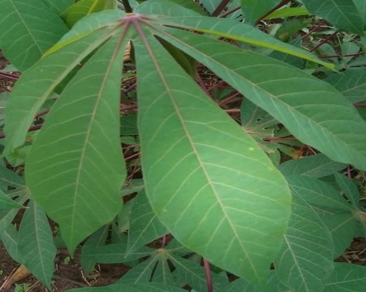

# Self Supervised Learning for Fine grained Classification

As part of our project we have worked on using self supervised learning for fine grained classification of cassava leaves diseases. We've explored 3 different methods for applying self supervised learning - 
- SRGAN
- Jigsaw as pretext task
- SimCLR

The features learnt during the pretext task are used for classification. The code is separated into these 3 folders.

Our Baseline is a supervised fine grained classification model [Fine-Grained Visual Classification via Progressive Multi-Granularity Training of Jigsaw Patches](https://arxiv.org/abs/2003.03836). The baseline achieved an accuracy of 88% on the dataset.

## Dataset

We have used the cassava leaves fine grained diseases dataset from Kaggle. The dataset has ~12K unlabelled images (extraimages.zip) and ~6K labelled images (train.zip).
The dataset can be downloaded from [here](https://www.kaggle.com/c/cassava-disease/data). It has 5 disease classes as shown in the following order - cbb,cbsd,cgm,cmd,healthy

 &nbsp;  &nbsp;  &nbsp;  &nbsp; 

For the pretext task training, we've used the extra images (unlabelled). For the downstream task training, we've used the train images (labelled).

## General dependencies

- python >= 3.6
- torch
- torchvision
- PIL
- Opencv
- numpy
- scikit-learn
- scipy

## How to run

We've included the code in the form of Jupyter notebooks to make it easy to visualize and run each cell.
