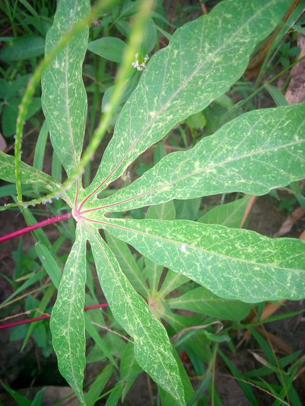
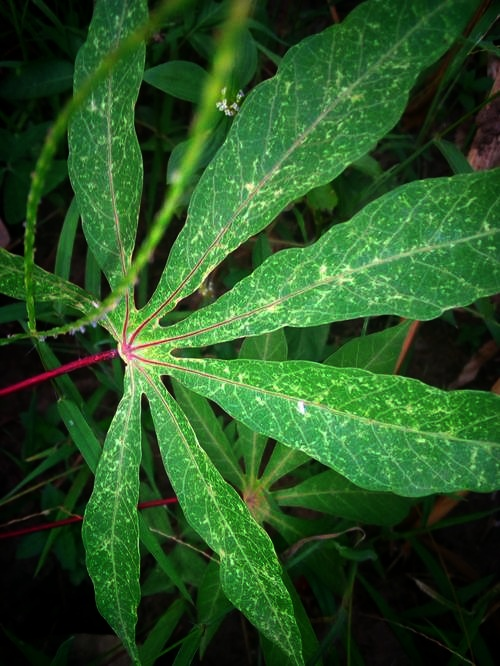
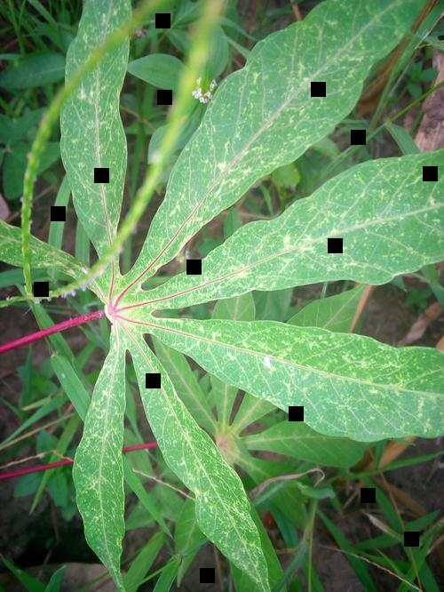
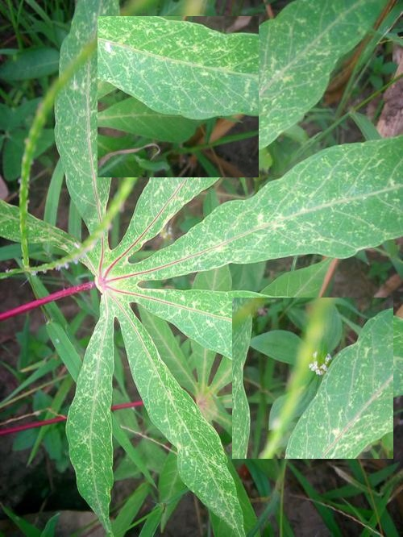
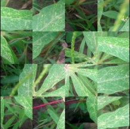
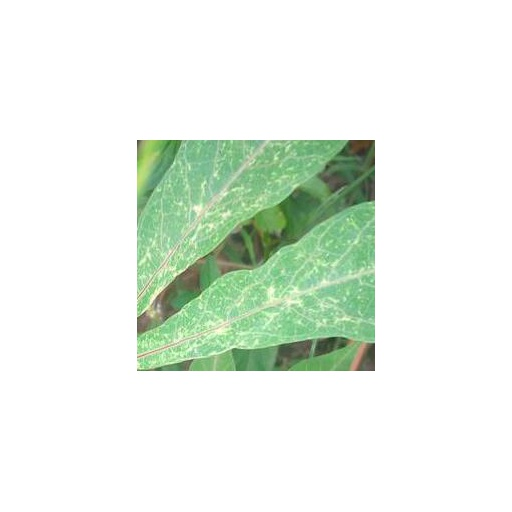

# SimCLR

[SimCLR](https://arxiv.org/abs/2002.05709) is a self supervised learning algorithm based on contrastive loss, NT-Xent.

## Files

- SimCLR_Original.ipynb: Contains code for original SimCLR model with the default augmentations, except gaussain blur
- SimCLR_Gamma.ipynb: Contains modification for using Gamma transform and Grad-CAM visualization <br/>
   &nbsp;  &nbsp;
- SimCLR_Cropped_regions.ipynb: Contains modifications for using Coarse Dropout and Grad-CAM visualization <br/>
   &nbsp;  &nbsp;
- SimCLR_Random_swapping.ipynb: Contains modifications related to using random patch swap augmentation and Grad-CAM visualization <br/>
  &nbsp;  &nbsp;
- SimCLR_Random_Jigsaw.ipynb: Contains modifications related to using random jigsaw augmentation and Grad-CAM visualization <br/>
   &nbsp;  &nbsp;
- SimCLR_DCL_Jigsaw.ipynb: Contains modifications related to using [DCL](https://openaccess.thecvf.com/content_CVPR_2019/papers/Chen_Destruction_and_Construction_Learning_for_Fine-Grained_Image_Recognition_CVPR_2019_paper.pdf) based jigsaw shufflling <br/> augmentation and Grad-CAM visualization <br/>
   &nbsp;  &nbsp;
- SimCLR_Cropped_regions.ipynb: Contains modifications related to localizing fine grained region ([Smartcropping](https://github.com/fizzday/imageCropSmart)) and Grad-CAM visualization <br/>
   &nbsp;  &nbsp;
- Pretrained models folder: Contains saved models for each of the above augmentations
- Demo folder: Contains demo code for SimCLR, predicts class for input image with sample input and output

## To install

`pip install python-opencv` <br/>
`pip install -U albumentations` <br/>
`pip install git+https://github.com/fizzday/imageCropSmart` <br/>

## To run

Download extraimages from [here](https://www.kaggle.com/c/cassava-disease/data?select=extraimages.zip) and train images from [here](https://mbzuaiac-my.sharepoint.com/:u:/g/personal/20020076_mbzuai_ac_ae/EbYi3fiug3FAjjjT7UcLfJgBdvnnO6b_8RE4HzZbUJTscQ?e=rfmfym) <br/>

Then run the cells of the jupyter notebook

## Steps to run Demo_test.ipynb

Replace model name from the pretrained models folder <br/>
```ckpt = torch.load('fullmodel_dcl.ckpt')``` <br/>

Ensure image is placed in path ```test/unknown``` <br/>
```img = cv2.imread('test/unknown/train-cgm-651.jpg', 1)```
  
## Credits
 
[SmartCrop](https://github.com/fizzday/imageCropSmart) <br/>
[Grad-CAM](https://github.com/yaleCat/Grad-CAM-pytorch) - The base code for Grad-CAM has been obtained from here<br/>
[DCL](https://github.com/JDAI-CV/DCL) - Modifications for DCL based Jigsaw have been derived from here <br/>
[SimCLR](https://github.com/ssumin6/SimCLR) - The base code for SimCLR has been obtained from here <br/>
